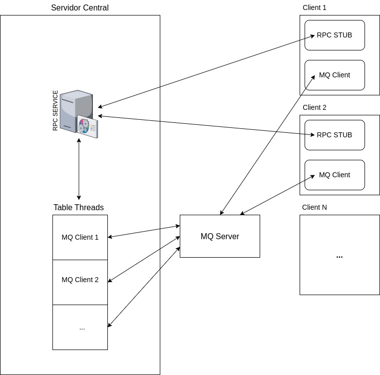

# Interface de Serviço

## Lobby: RPC
O lobby é implementado usando o protocolo RPC com Protobuf, onde são disponibilizados os comandos para criar uma sessão de jogo (mesa), verificar as sessões ativas, entrar em uma sessão e deixar uma sessão.

### Serviço

#### showTables
Mostra todas as sessões de jogo ativas. Retorna um fluxo de mensagens  "Tables".
```
showTables(Query) -> (stream  Table)
```
#### createNewTable
Cria uma sessão de jogo. Recebe um "Query" contendo o nome da sessão. Retorna um "QueryReply" contendo o status da requisição.
```
createNewTable(Query) -> (QueryReply)
--gera DuplicatedName.
```
#### joinTable
Entra em uma sessão de jogo. Recebe um "Query" contendo o nome da sessão, o nickname e o time. Retorna um "QueryReply" contendo o status da requisição e os nomes das filas de mensagem da sessão.
```
joinTable(Query) -> (QueryReply)
--gera DuplicatedName, NotFound, FullTeam, GameInitiated.

```
#### exitTable
Deixa uma sessão de jogo. Recebe um "Query" contendo o nome da sessão, o nickname. Retorna um "QueryReply" contendo o status da requisição.
```
exitTable(Query) -> (QueryReply)
```

### Corpos de requisição

#### Table:
```
message  Table {
string  name = 1;
repeated  string  team_A = 2;
repeated  string  team_B = 3;
repeated  int32  scoreboard = 4;
string  init = 5;
}
```
#### Query
```
message  Query {
string  tablename = 1;
string  nickname = 2;
string  team = 3;
}
```
#### QueryReply
```
message  QueryReply {
bool  status = 1;
string  cmdQueue = 2;
string  cliQueue = 3;
}
```

# Protocolo de Comunicação Por  Mensageiria
Para gerenciar os comandos das sessões de jogo, foram implementadas filas de mensagens para cada sessão utilizando o RabbitMQ. A troca de mensagens é feita utilizando o padrão JSON.

### Servidor:
```
# espera 4 jogadores
{ cmd: checkin, nickname: A1, team: A, checkin-total: self.checkin }
{ cmd: checkin, nickname: B1, team: B, checkin-total: self.checkin }
{ cmd: checkin, nickname: A2, team: A, checkin-total: self.checkin }
{ cmd: checkin, nickname: B2, team: B, checkin-total: self.checkin }

# start game
{ cmd: start-game, scoreboard: [0, 0], timeA: self.players[A], timeB: self.players[B]}}

# * repeat till A or B >= 12 *
#start round
{ cmd: start-round, scoreboard: [1, 0], vira: K♣}
{ cmd: draw, nickname: A1, cards: [A♣,A♥,A♠]}
{ cmd: draw, nickname: B1, cards: [A♣,A♥,A♠]}
{ cmd: draw, nickname: A2, cards: [A♣,A♥,A♠]}
{ cmd: draw, nickname: B2, cards: [A♣,A♥,A♠]}

# ** repeat 3 times **
# start mao
{ cmd: start-mao, order: [A1, B1, ..], maowinners: [A, B, ...], nextplayer: A1, truco: false, trucoTeam: None}

#throwcard
{ cmd: play, type: card, nickname: A1, card: A♣, nextplayer: B1, cardsInPlay: self.cardsInPlay, truco: false, trucoTeam: None}
{ cmd: play, type: card, nickname: B2, card: A♣, nextplayer: finish, cardsInPlay: self.cardsInPlay}

#truco
{ cmd: play, type: truco, nickname: B1, nextplayer: A2, truco: 3, trucoTeam: B, direction: direction}
{ cmd: play, type: seis, nickname: A2, nextplayer: B1, truco: 6, trucoTeam: A, direction: direction}
{ cmd: play, type: accept, nickname: B1, nextplayer: B1, truco: 6, trucoTeam: B}

# resultado
{ cmd: result-mao, winnerTeam: winnerTeam, winnerPlayer: winnerPlayer, maowinners: self.maoWinners})

# withdraw
{cmd: play, type: withdraw, nickname: nickname}
# end mao

# ** repeat max 3 times **
#end round
{ cmd: result-round, winnerTeam: TeamA}

# * repeat till 12 *
#end game
{ cmd: result-game, winnerTeam: TeamA, scoreboard: self.scoreboard}
{ cmd: end-game}
```
### Jogadores
```
{ cmd: checkin, nickname: nickname}
{ cmd: play, type: card, nickname: nickname, cardindex: index }
{ cmd: play, type: withdraw, nickname: nickname}
{ cmd: play, type: truco, nickname: nickname}
{ cmd: play, type: accept, nickname: nickname, direction: direction}
{ cmd: play, type: seis, inResponse: trucoRes, nickname: nickname} 
```

# Arquitetura do Sistema
